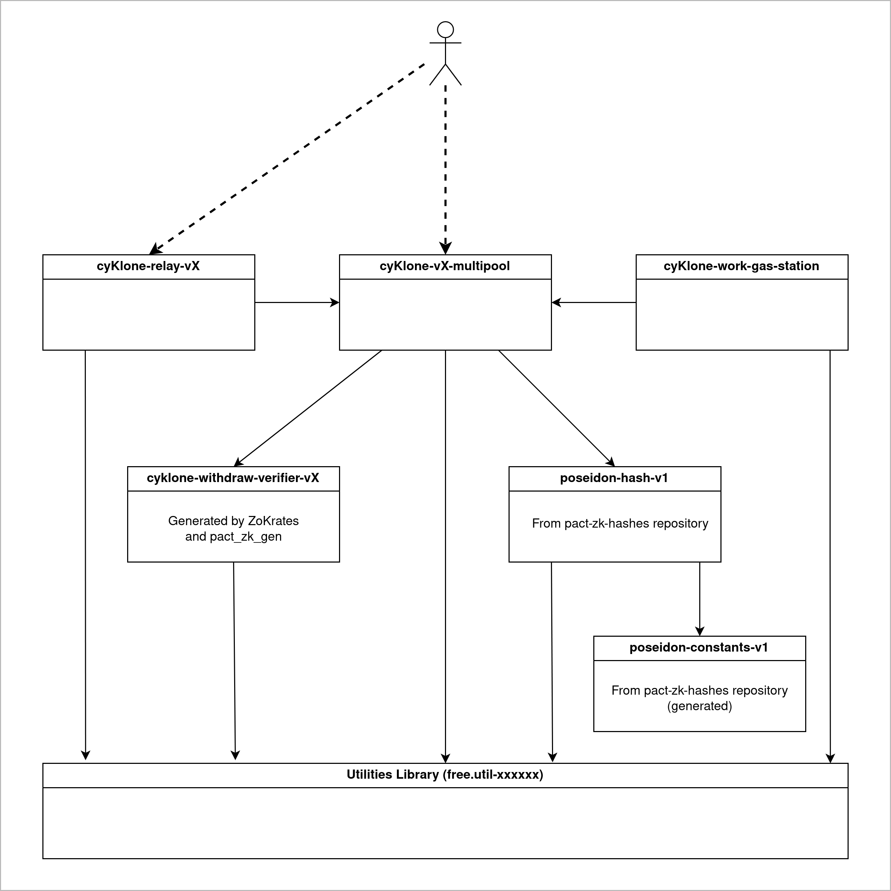

# cyKlone

**Work in progress**

## Intro

This project aims to create an anonymity contract for Kadena, using the new Zero Knowledge features of Pact 4.6.

This work is based on Tornado Cash, with following specificities:

  - The contract is in Pact, and adapted to Kadena.
  - There is no notions of Relayers, since the same feature (100% untraceable withdrawal) can be better handled by a gas station contract
  - The circuit is programmed in ZoKrates, since the circuit of Tornado Cash uses old Circom syntax.
  - The hash used to build Merkle trees is Poseidon. Poseidon is more modern and uses less resources than the MiMC algorithm of Tornado Cash.
  - The deposit procedure has to be done in several transactions, because high integers math function are gas expensive, compared to Ethereum (see https://github.com/kadena-io/pact/issues/1152)

---

This project uses the following tools:
  - [ZoKrates](https://zokrates.github.io/) for circuit development and compilation
  - [Pact ZK tool](https://github.com/CryptoPascal31/pact-zk-generator) for Pact module automatic generation.
  - [Pact util libraries](https://github.com/CryptoPascal31/pact-util-lib)
  - [Pact ZK hash library](https://github.com/CryptoPascal31/pact-zk-hashes) to compute on-chain Poseidon hashes.

## Principle of operation

### Modules

The protocol is organized in several modules:
   - `cyKlone-mutipool-V0`  => main module, manages most stuffs
   - `poseidon-hash-v1` and `poseidon-constants-v1` => Compute the Poseidon Hash
   - `cyklone-withdraw-verifier-v0` => Auto generated module to verify the ZK proof.

There are 2 helpers modules:
   - `cyKlone-work-gas-station` => Gas station to pay gas for the `(work)` transactions.
   - `cyKlone-relay-v0` => Gas station and intermediate account to let users withdraw while paying gas anonymously.

### Deposits/Withdrawal flow

## TODO
  - Create a web UI
  - Organize a safe setup for the ZK keys.
